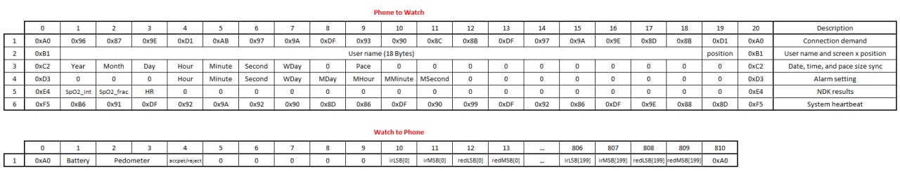

# open-watch android app

**Libraries/Projects Used:**
- [XmlByPass](https://github.com/Aghajari/XmlByPass)
- [AXAnimation](https://github.com/Aghajari/AXAnimation)
- [AXGraphView](https://github.com/Aghajari/AXGraphView)
- [AXPathLoadingView](https://github.com/Aghajari/AXPathLoadingView)
- [SimpleChart](https://github.com/Aghajari/SimpleChart)

## Connection

Android app connects to watch via classic bluetooth.  
Whenever the socket created android app sends the `Connection demand` packet and waits for the acknowledge. 
Then app sends a filtered username to the watch so watch can say Hello to that user. 
At the end app sends some config data such as user's device date & time and user's step-size to calculate distance in km. 
App sends the `System heartbeat` packet to watch every 800ms so that watch verifies the app. 
App sends the `Alarm setting` packet whenever the user sets an alarm. 
Whenever the watch sends 5 signal packets (1000 samples) to the app, the PPG algorithms will filter the signal and calculate HR and SpO2, and then the app will send the `NDK Results` packet to the watch.
